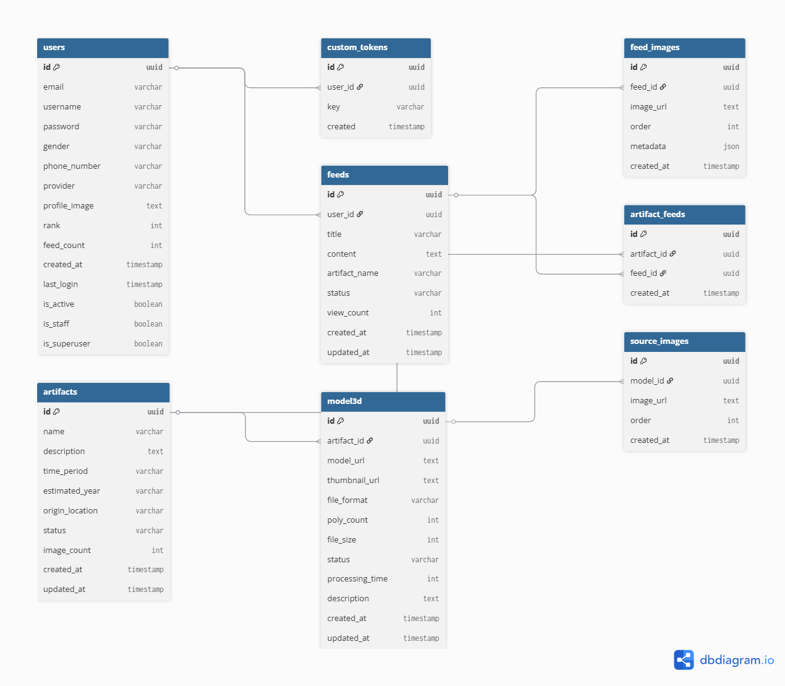

<div align="center">

  <h1>OnGi</h1>
  <p><strong>Record Our Cultural Heritage, Bring It Back in 3D</strong></p>

  <p>
    
    
    
  </p>
</div>

---

## About

Korea is home to thousands of cultural artifacts — ancient Buddhist statues, royal relics, and excavated treasures that carry centuries of history. Yet many of them remain fragile, undocumented, and at risk of being lost forever.

OnGi is a crowdsourced cultural heritage preservation platform inspired by the idea that everyday people, armed with nothing more than a smartphone camera, can collectively help protect and restore history. When users visit a museum, a temple, or a historic site, they photograph the artifacts they encounter and upload them to the app. These photos are tagged, accumulated, and when enough images of the same artifact are gathered, a 3D model is reconstructed using photogrammetry — turning a crowd of ordinary snapshots into a digital preservation of a national treasure.

The more people contribute, the richer and more accurate the archive becomes. OnGi turns every visitor into a guardian of Korean cultural heritage.

---

## How It Works

<div align="center">
  
</div>

<br/>

### 1. Capture & Upload
Users visit museums, temples, and historic sites and photograph the artifacts they encounter. Each photo is uploaded to the app along with the artifact name as a tag. Multiple images can be attached to a single feed, and all uploads are stored with metadata for later use in 3D reconstruction.

### 2. Crowdsource & Accumulate
Photos from different users of the same artifact are automatically grouped together by artifact name. The system continuously tracks the total image count across all related feeds. Once 10 or more images of the same artifact are collected, an artifact entry is automatically created in the system and linked to all contributing feeds.

### 3. Review & Verify
Admins review the automatically generated artifact entries through the Django Admin panel. They verify the artifact's information — name, era, origin location, and description — and update the status from `auto_generated` to `verified` or `featured`. Rejected entries are hidden from public view. Only verified artifacts are surfaced to general users in the app.

### 4. Reconstruct in 3D
Once an artifact is verified, the accumulated source images are exported and processed through photogrammetry software. The software analyzes camera positions and overlapping image data to reconstruct a precise, textured 3D model. The completed model — along with its metadata such as polygon count, file size, and format — is then uploaded back to the system.

### 5. Explore & Preserve
The 3D model is published in the app for anyone to explore. Users can view the artifact from every angle directly in the app, read its historical background, and browse the community feeds that made the reconstruction possible. Every artifact in OnGi is not just a digital object — it is a piece of Korean heritage preserved for future generations.

<div align="center">
  
</div>

---

## Database ERD

<div align="center">
  
</div>

---

## Tech Stack

| | Technology |
|---|---|
| **Frontend** | Flutter |
| **Backend** | Django REST Framework |
| **Database** | PostgreSQL |
| **Admin** | Django Admin |
| **State Management** | Provider |

---

## Getting Started

### Requirements
- Flutter SDK 3.6.1
- Python 3.11.5
- PostgreSQL

### Backend
```bash
cd OnGi_api
pip install -r requirements.txt
python manage.py migrate
python manage.py runserver
```

### Frontend
```bash
cd OnGi_flutter
flutter pub get
flutter run
```

---

## Developer

**Jihun Cho**
- GitHub: [@Jihun37](https://github.com/Jihun37)
