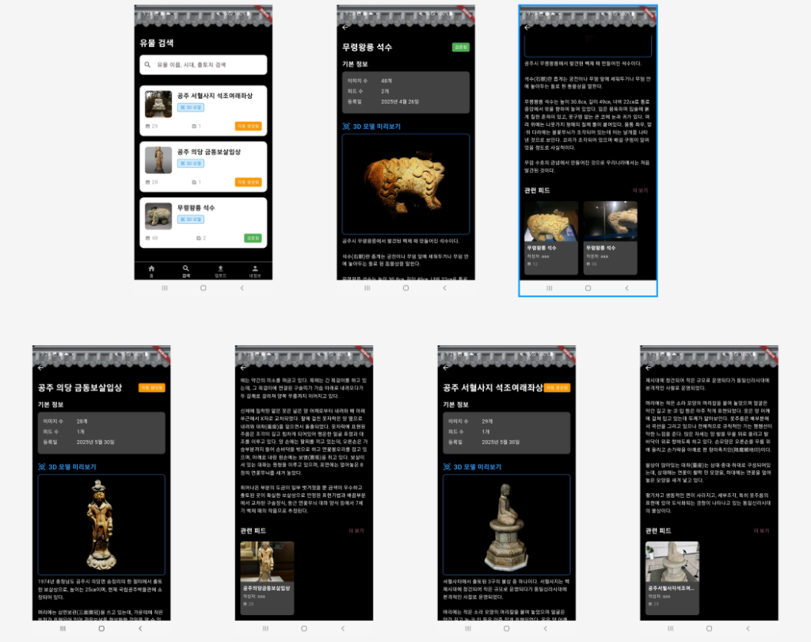
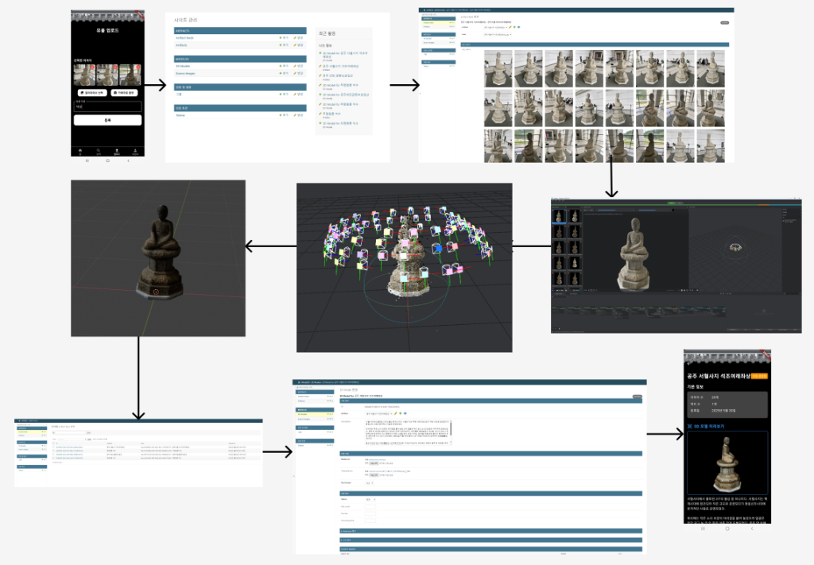

<div align="center">

  <h1>OnGi</h1>
  <p><strong>Record Our Cultural Heritage, Bring It Back in 3D</strong></p>

  <p>
    
    
    
  </p>
</div>

---

## About

Korea is home to thousands of cultural artifacts — ancient Buddhist statues, royal relics, and excavated treasures that carry centuries of history. Yet many of them remain fragile, undocumented, and at risk of being lost forever.

OnGi is a crowdsourced cultural heritage preservation platform inspired by the idea that everyday people, armed with nothing more than a smartphone camera, can collectively help protect and restore history. When users visit a museum, a temple, or a historic site, they photograph the artifacts they encounter and upload them to the app. These photos are tagged, accumulated, and when enough images of the same artifact are gathered, a 3D model is reconstructed using photogrammetry — turning a crowd of ordinary snapshots into a digital preservation of a national treasure.

The more people contribute, the richer and more accurate the archive becomes. OnGi turns every visitor into a guardian of Korean cultural heritage.

---

## Features

### Artifact Search
<div align="center">
  
</div>

- Search artifacts by name, era, or excavation site
- View artifact details including image count, feed count, and registration date
- Filter artifacts by status (verified, featured, etc.)

<br/>

### Artifact Detail & 3D Model
- Browse basic artifact info — era, estimated year, origin location, and description
- Preview the 3D model directly in the app
- View all related feeds linked to the artifact

<br/>

### Feed Upload
- Photograph an artifact and upload it as a feed
- Tag the artifact name for automatic archiving
- Once 10 or more images of the same artifact are collected, the artifact is created automatically

<br/>

### Admin System
<div align="center">
  
</div>

- Artifact management via Django Admin
- Manage artifact status (auto generated → verified → featured / rejected)
- Inline preview of linked feeds and images
- Integrated with 3D reconstruction software to generate models

---

## Workflow

```
User captures & uploads photos
        ↓
Feeds auto-classified by artifact name
        ↓
10+ images collected → Artifact auto-created
        ↓
Admin reviews & verifies
        ↓
3D reconstruction software generates model
        ↓
3D model & artifact info served in app
```

---

## Tech Stack

| | Technology |
|---|---|
| **Frontend** | Flutter |
| **Backend** | Django REST Framework |
| **Database** | PostgreSQL |
| **Admin** | Django Admin |
| **State Management** | Provider |

---

## Getting Started

### Requirements
- Flutter SDK 3.6.1
- Python 3.11.5
- PostgreSQL

### Backend
```bash
cd OnGi_api
pip install -r requirements.txt
python manage.py migrate
python manage.py runserver
```

### Frontend
```bash
cd OnGi_flutter
flutter pub get
flutter run
```

---

## Developer

**Jihun Cho**
- GitHub: [@Jihun37](https://github.com/Jihun37)
